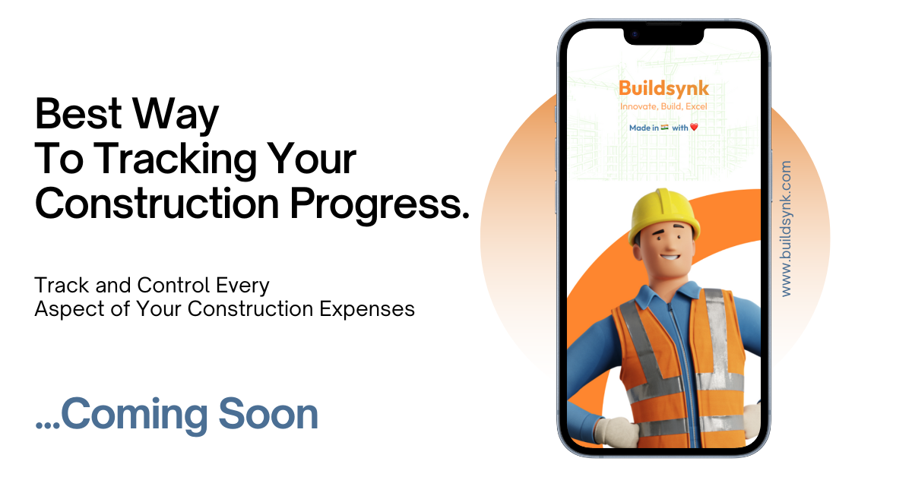

<h1 align="center">
    
</h1>

<h3 align="center">An aspiring software developer from the vibrant landscapes of Bharat 🇮🇳 </h3>

 

 
 <h2> 🔭 I’m currently working on a very simple side project <b>Buildsynk - Construction Management Application 🏗️ </b> </h2>
 I'm using MER(React Native)N stack to build the application

    
  

       
  
       
 

  

 
           
  
  
  <a href="https://github.com/DebadritaGhosh?tab=repositories" target="_blank">
      <!-- sqlite, safari, google-chrome are other good icon options -->
  </a>

 

 
<h2 align="center">⚒️ Languages-Frameworks-Tools ⚒️</h2>
 

     
    

 

  <h2>🚀 My Contributions 🚀</h2>
   
  
  
     

<h2 align="center">⚡ Stats ⚡</h2>
 

  
  
   
  

 

<h2 align="center">Collaborate Now</h2>

Interested in contributing ideas or suggestions to enhance BuildSynk, my cutting-edge construction management mobile application designed for both Android and iOS users? Feel free to share your insights and recommendations by connecting with me on LinkedIn. Your valuable input will play a crucial role in shaping the future of BuildSynk. Let's collaborate and build something extraordinary together!

 
