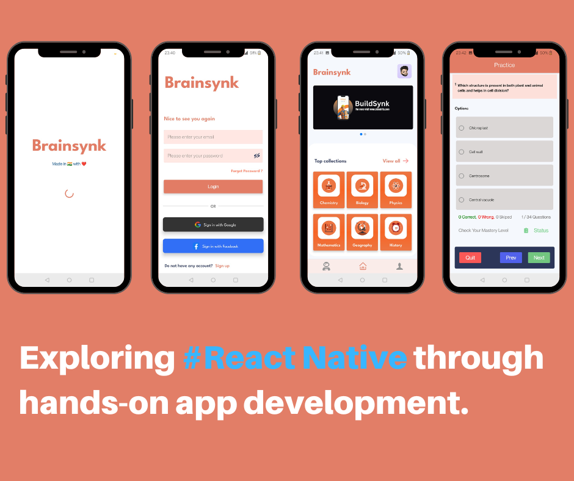

<h1 align="center">
    
</h1>

<h3 align="center">An aspiring software developer from the vibrant landscapes of Bharat 🇮🇳</h3>

 

    

     
    
     

<h4 align="center">🌟 Currently, I'm working on a neat project called Buildsynk - it's an app for managing construction 🏗️. I'm using the MER(Native)N stack to build it. Right now, I'm handling both the front and back parts of the project.</h4>

 

     
    
     
    <h4>🌟 Around two years ago, I created a basic quiz app called ExamDojo before developing the BrainSynk app. It's a simple app designed for college students, especially those studying BCA, MCA, BTECH & MTECH. I worked on the app's appearance using React Native and Expo, while a friend handled the backend using Codeigniter (Php). This isn't a commercial release; it's just a practice project. Please use it for practice purposes only. The app is very straightforward, mostly using white and black colors. By the way, I'm currently seeking new opportunities. Let me know if there's a job opening or if you can provide a referral.</h4>

     
    
     
    <h4>🌟 About a year ago, I created a simple quiz app called Brainsynk, which came after the ExamDojo app. It's for students and is quite similar to ExamDojo, but they have some different features and purposes. You'll see the differences when you use them. Like before, I worked on the app's appearance using React Native, while my friend handled the backend using Codeigniter (Php). Now, we're thinking of putting the backend online and uploading the app to the Play Store. This way, potential employers can check it out and decide if they want to hire me. But before we do that, we want to make the app look better. Let's see what improvements we can make. Also, just a reminder, I'm currently looking for new opportunities. Please let me know if you know of any job openings or if you can provide a referral!</h4>

 
     
    
    
    <a href="https://github.com/DebadritaGhosh?tab=repositories" target="_blank">
         <!-- sqlite, safari, google-chrome are other good icon options -->
    </a>

<h2 align="center">⚒️ Languages-Frameworks-Tools ⚒️</h2>

 

     
    

 

    <h2>🚀 My Contributions 🚀</h2>
     
    
       

<h2 align="center">⚡ Stats ⚡</h2>

 

    
    
     
    

 

<h2 align="center">Collaborate Now</h2>

    
    
Interested in contributing ideas or suggestions to enhance BuildSynk, my cutting-edge construction management mobile application designed for both Android and iOS users? Feel free to share your insights and recommendations by connecting with me on LinkedIn. Your valuable input will play a crucial role in shaping the future of BuildSynk. Let's collaborate and build something extraordinary together!

 
